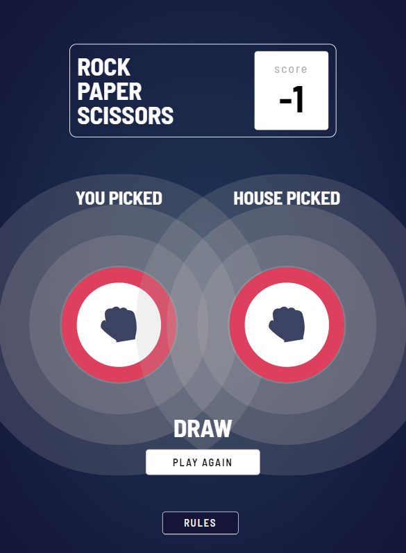

# Rock Paper Scissors Game

This is a simple web application for playing the classic game of Rock Paper Scissors against the computer. The game is built using React.js.
## Live Link [https://dwidenbrahma.github.io/rockpapperscissor/]

## Table of Contents

- [Features](#features)
- [How to Play](#how-to-play)
- [Components](#components)
- [Styling](#styling)
- [Screenshots](#screenshots)
- [Installation and Setup](#installation-and-setup)
- [Technologies Used](#technologies-used)
- [Author](#author)
- [License](#license)

## Features

- **Gameplay**: Choose between Rock, Paper, or Scissors and see the result of your choice against the computer.
- **Score Keeping**: Keep track of your score as you play.
- **Modal Rules**: Access the rules of the game through a modal window.
- **Responsive Design**: The application is designed to be responsive and can be played on various devices.

## How to Play

1. Choose your move by clicking on one of the icons (Rock, Paper, or Scissors) on the game board.
2. The computer will randomly select its move.
3. The result of the game will be displayed, and your score will be updated accordingly.
4. You can view the rules of the game by clicking on the "Rules" button.

## Components

### App.js

- The main component that orchestrates the game.
- Manages state related to the score, user selection, and modal visibility.
- Renders other components like the game board, score container, and rule modal.

### Board.js

- Renders the game board with options to select Rock, Paper, or Scissors.
- Passes user selection to the parent component.

### Modals.js

- Renders a modal window displaying the rules of the game.
- Allows users to close the modal window.

### Select.js

- Handles the logic for the game outcome.
- Generates a random move for the computer.
- Determines the winner and updates the score.

### WhoWin.js

- Determines the winner of the game based on user and computer selections.
- Renders different components based on the game outcome (draw, player win, or computer win).

## Screenshots

## Installation and Setup

To run the application locally:

1. Clone this repository to your local machine.
2. Navigate to the project directory in your terminal.
3. Run `npm install` to install dependencies.
4. Run `npm start` to start the development server.
5. Open your browser and navigate to `http://localhost:3000` to view the application.

## Technologies Used

- React.js
- CSS

## Author

[Dwiden Brahma]

## UPCOMMING...............!

Upcoming updates will include multiplayer functionality.

